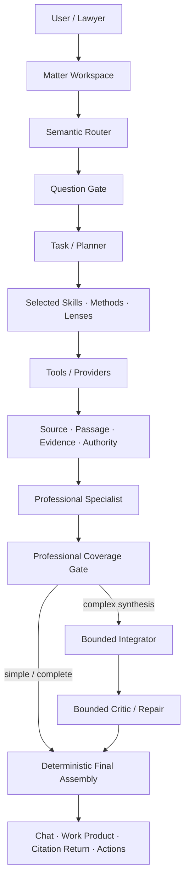

# Linghang · 领航

**Evidence-grounded legal intelligence that works around a Matter, not a single chat.**

> 领航是一套面向真实法律实务的 AI 工作台：把咨询、研究、证据、合同、诉讼、文书、协作与审批组织在同一个 **Matter** 中，并让每一个重要法律结论都能够回到可核验的来源与原文位置。

[Live Demo — current competition preview](https://linghang-git-feature-fronten-11ae7e-1151822948ju-3766s-projects.vercel.app)

> This repository is a **public competition showcase**. The production repository, prompts, provider configuration, private evaluation fixtures, and proprietary implementation remain private.

---

## Why Linghang

Most legal AI products are optimized for a single turn: ask a question, receive an answer.

Linghang is designed around the lifecycle of a legal **Matter**:

- one Matter can contain multiple conversations;
- uploaded documents retain versions and legal-use boundaries;
- research results are separated into Source, Passage, Evidence, Authority, and proposition-level support;
- AI-generated work product can be opened in-page, revised locally, and tracked by immutable revision lineage;
- lawyers, trainees, supervisors, and client reviewers can collaborate with Matter-scoped permissions;
- sanitized-only collaborators can work from derivative documents without receiving the original;
- a citation can return the user to the exact source passage instead of only showing a generic URL.

## Product Experience

### 1. ChatGPT-style conversation, legal-Matter memory

The workspace combines a natural chat experience with a persistent Matter model. A Matter can contain multiple chat sessions, documents, work products, decisions, actions, and collaborators.

### 2. Source → exact passage → verification

A legal proposition is not treated as supported merely because a source exists. Linghang separates:

`Source identity` → `Passage` → `Evidence / Authority relationship` → `Proposition support` → `User-facing citation`

The UI consumes canonical citation targets, enabling authorized source preview and exact-passage return.

### 3. Documents and work product stay inside the workspace

Generated or uploaded files are first-class workspace objects rather than download links:

- PDF / DOCX / structured work product preview;
- document version history;
- artifact family / revision history;
- bounded block or text-range rewrite;
- source-bound limitations and reliance state;
- protected download only when authorized.

### 4. Matter Team, not global sharing

Access is scoped to the Matter. Collaboration presets include trainee, supervisor, and client reviewer, with document scopes and bounded capabilities such as view, comment, propose edit, edit, review revision, and approval.

A **shared chat** is only a transcript snapshot. It does **not** grant Matter access.

### 5. Professional AI workflow

Linghang does not ask a single model to do everything. The canonical workflow separates routing, clarification, tools, professional methods, model synthesis, coverage checks, and bounded critique.



The key design rule is simple:

> **AI handles semantic legal judgment; deterministic code protects identity, source binding, permissions, approval, state transitions, and provenance.**

## Core Differentiators

| Capability | Linghang approach |
|---|---|
| Legal research | Source/Passage/Authority separated from generated analysis |
| Evidence | Proposition-level support state instead of “a citation exists” |
| Matter continuity | Multiple chats, documents, actions and work products under one Matter |
| Contract work | Clause/issue reasoning, proposed redline vs approved change, version lineage |
| Litigation | Claims, defenses, elements, evidence, authority and procedural posture |
| PE/VC | Scenario calculations remain distinct from document facts |
| Documents | Versioned files, in-page workbench, bounded rewrite and history |
| Collaboration | Matter-scoped roles, document scope, sanitized-only review |
| Citations | Canonical exact-passage return target rather than model-generated URLs |
| Prompt governance | Approved prompt modules, shadow/selective rollout, bounded coverage checks |
| Visual/file retrieval | Related assets remain candidates until explicitly promoted into the evidence system |

## Trust Model

Linghang deliberately preserves distinctions that generic RAG systems often collapse:

- allegation ≠ verified fact;
- source text ≠ truth;
- evidence ≠ legal authority;
- authority identity ≠ authority application;
- source exists ≠ passage supports proposition;
- proposed change ≠ approved change;
- delivered file ≠ legal-reliance ready;
- related image/file candidate ≠ evidence.

See [Trust & Safety Model](docs/TRUST_MODEL.md).

## Prompt & Skill Architecture

Professional performance is not reduced to one giant prompt. The production design separates a stable legal constitution, an aggressive professional-performance baseline, scenario profiles, task-selected professional skills/methods, and output policy. The lightweight semantic router does **not** receive the full legal-performance prompt.

Detailed production prompts and proprietary Skill/Method instructions are intentionally not published here.

See [Architecture](docs/ARCHITECTURE.md).

## What to Demo in 5 Minutes

1. Start a new chat and upload a contract.
2. Let Linghang create/bind the Matter without a long intake form.
3. Open a source-backed answer and click a citation to return to the exact passage.
4. Open the generated legal work product inside the workspace.
5. Select one block and request a bounded rewrite; show the child revision and history.
6. Open the Matter and show Chats, Documents, Work Product, and People & Access.
7. Invite a trainee or sanitized-only client reviewer and explain the permission boundary.
8. Show that a related asset is labeled **Candidate — not Evidence**.

Full script: [Demo Guide](docs/DEMO_GUIDE.md).

## Current Validation Status

The public showcase intentionally distinguishes implementation from live validation.

Selected focused checks completed in the private engineering repository include:

- Frontend F1 contract foundation: **19/19**;
- Chat-share isolation: **8/8**;
- Prompt Governance PG-1: **21/21**;
- Prompt Governance PG-2: **26/26**;
- Prompt Governance PG-3: **22/22**;
- Practice production reachability: **15/15**;
- Skill/Method reasoning representative suite: **12/12**;
- Lens runtime representative suite: **30/30**.

Live prompt A/B, full production smoke, lawyer validation, and real-user validation are intentionally tracked separately and are not claimed as complete here.

## Public Repository Scope

Published here:

- project README;
- product architecture;
- trust model;
- demo and judging guide;
- capability matrix;
- sanitized public contracts and example payloads.

Not published:

- production source code;
- owner-approved prompt text;
- proprietary Skill/Method bodies;
- private provider configuration and credentials;
- internal datasets, gold cases, or evaluation fixtures;
- customer/Matter data;
- private deployment infrastructure.

See [Repository Scope](docs/REPOSITORY_SCOPE.md).

## Repository Layout

```text
.
├── README.md
├── docs/
│   ├── ARCHITECTURE.md
│   ├── CAPABILITIES.md
│   ├── DEMO_GUIDE.md
│   ├── JUDGING_GUIDE.md
│   ├── REPOSITORY_SCOPE.md
│   └── TRUST_MODEL.md
├── public-contracts/
│   ├── chat-final-payload.ts
│   ├── evidence-return-target.ts
│   └── matter-collaboration.ts
└── examples/
    ├── chat-final-payload.example.json
    └── evidence-return-target.example.json
```

## Intellectual Property

This repository is provided for project demonstration and evaluation. No license to the private Linghang production implementation, prompts, models, or proprietary workflow definitions is granted by publication of this showcase repository.
