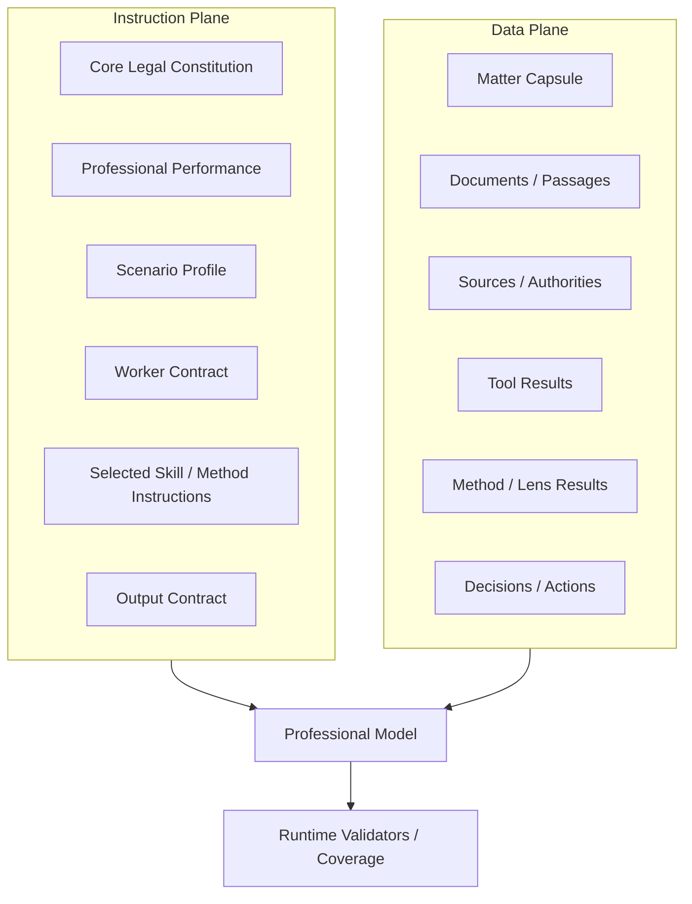

# Linghang Architecture

## Design Goal

Linghang treats legal AI as a stateful professional system rather than a chat completion wrapper. The architecture separates user experience, legal work orchestration, semantic model work, deterministic trust gates, Matter data, and external tools/providers.

## End-to-End Flow

```mermaid
flowchart LR
    UI[Chat + Matter Workspace] --> API[Authorized Chat / Matter APIs]
    API --> MAT[Matter + Session + Documents]
    MAT --> ROUTER[Semantic Router]
    ROUTER --> QG[Question Gate]
    QG --> PLAN[Task / Planner]
    PLAN --> SKILL[Selected Skills / Methods / Lenses]
    SKILL --> TOOL[Tools / Providers]
    TOOL --> SOURCE[Source / Passage / Evidence / Authority]
    SOURCE --> SPEC[Professional Specialist]
    SPEC --> COVER[Coverage Gate]
    COVER --> INT[Optional Integrator]
    INT --> CRIT[Optional Critic]
    CRIT --> FINAL[Deterministic Final Assembly]
    COVER --> FINAL
    FINAL --> OUT[Chat + Citations + Artifacts + Actions]
```

## Instruction Plane vs Data Plane

One of the core safety rules is that documents and external content are **data**, not higher-priority instructions.

## Matter as the Primary Unit

A Matter can hold:

- multiple chat sessions;
- documents and document versions;
- sources and passages;
- facts, claims, defenses, elements and evidence;
- legal research and authority applications;
- professional method results;
- decisions, approvals and actions;
- work-product artifact families and revisions;
- collaborators and document-scoped grants.

This lets a later conversation continue work without asking the user to re-explain the entire legal problem.

## Professional Model Stages

The production architecture distinguishes stages instead of giving every model the same prompt.

- **Semantic router:** lightweight classification only; no substantive legal conclusion.
- **Question Gate:** asks a single high-value clarification only when a user-controlled blocker exists.
- **Tools / retrieval:** produce source-bound data, not final legal truth.
- **Professional specialist:** performs domain work using selected Skills/Methods/Lenses.
- **Coverage:** ensures material professional findings are consumed or explicitly omitted for an allowed reason.
- **Integrator:** used only for genuinely complex synthesis.
- **Critic:** bounded review/repair; cannot research new law or invent sources.
- **Final assembly:** deterministic response projection and artifact/citation linking.

## Data & Trust Boundaries

The production repository uses deterministic guards for permissions, source identity, exact passage binding, version state, approval, action completion, document-use controls, and artifact lineage.

The public showcase does not include private schemas, prompt source, provider credentials, deployment topology, or internal evaluation datasets.
